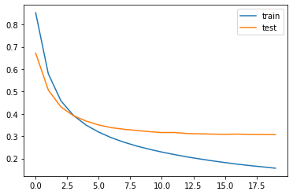
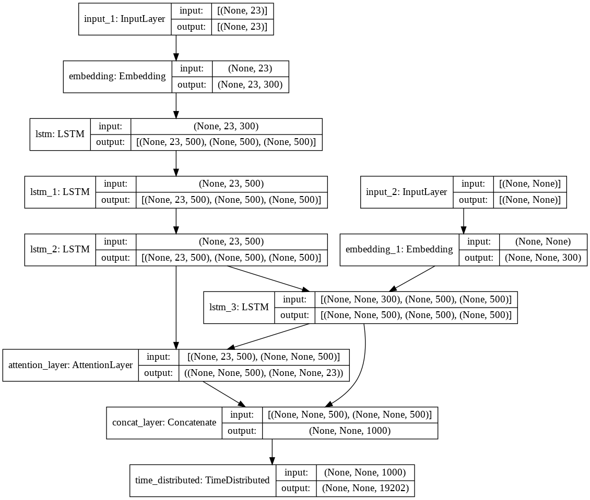

# Overview


Machine translation is a sub-field of computational linguistics that investigates the use of software to translate text or speech from one language to another. On a basic level, it performs simple substitution of words in one language for words in another, but that alone usually cannot produce a good translation of a text because recognition of whole phrases and their closest counterparts in the target language is needed. Solving this problem with corpus statistical, and neural techniques is a rapidly growing field that is leading to better translations, handling differences in linguistic typology, translation of idioms, and the isolation of anomalies.


A deep learning based approach to MT, Neural Machine Translation has made rapid progress in recent years. **Translator** is a Machine Translation Autoencoder built using Seq2Seq Recurrent Nets (LSTM, GRU) with Attention Layers.

## Built With

- Python
- Keras

## Dataset

[ManyThings.org](http://www.manythings.org/anki/).


## Results
The model was fit for 20 epochs with the training loss of 0.1507 and accuracy 0.9659.
The validation loss is  0.3070 with validation accuracy 0.9486.

**Loss Diagram**



**Model Architecture**




Translations from English to French
```
Review: hope boring 
Original summary: esp ennuie 
Predicted summary:  esp trop ennuyeux


Review: allowed 
Original summary: cela permis 
Predicted summary:  autoris


Review: look fabulous 
Original summary: air resplendissante 
Predicted summary:  air resplendissant


Review: deals furniture 
Original summary: fait commerce meubles 
Predicted summary:  propri taire


Review: book 
Original summary: livre 
Predicted summary:  livre


Review: think funny 
Original summary: pense marrante 
Predicted summary:  pense amusant


Review: suit anything cheap 
Original summary: costume tout sauf bon march 
Predicted summary:  cette quelque chose auquel bon march


Review: ran ahead warn everybody 
Original summary: courus devant avertir tout monde 
Predicted summary:  couru devant avertir tout monde


Review: find get best flavor OOV fresh OOV 
Original summary: trouve obtiens meilleure saveur moulant grains poivre frais 
Predicted summary:  trouv meilleur meilleur moyen agir glac


Review: right 
Original summary: devrais faire champ 
Predicted summary:  juste


Review: speech made sense 
Original summary: discours aucun sens 
Predicted summary:  discours tait sens


Review: let take nap 
Original summary: laisse faire sieste 
Predicted summary:  faisons faire sieste


Review: officer inspired men brave 
Original summary: officier encouragea hommes faire preuve bravoure 
Predicted summary:  officier courage courage hommes


Review: one 
Original summary: agit tres 
Predicted summary:  puis avoir


Review: canceled 
Original summary: annul 
Predicted summary:  annul
```


